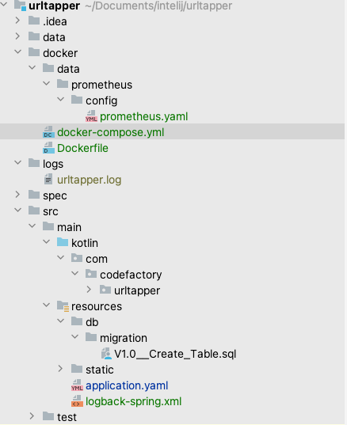

# UrlTapper #
###### v 0.0.1 - Draft initial version
######  Author: Sam

# Description #
#### This rest API helps the end user shorten the URL and can be retrieved via the hashing key or hashed URL.

# Use Case Brief #
1. The user passes the long URL to one of the rest API methods, it has to generate the hashing which can be sent back to the user again.
2. The user passes the shortened or hashed URL to one of the rest API methods, it has to send back the longer / actual URL to the end user.

Based on the use case and Requirement document, we are adding the following input considered for designing this application,
- scalable, maintainable , production ready API, easily deployed in any environments.
- monitoring and study the complex problems through interfaces

# Assumptions & Considerations #
Since it's a minimum viable product, as a developer, I have taken the following assumption and consideration help to the design and development of API.
1. This proof concept could be a full-fledged solution in the future.
2. This API exposes two different functions outside the world.

    a) tapUrl() - post the longer URL link and retrieve the hashed key or an URL.
    b) getUrl() - post the shortened URL or hashed key and retrieve the longer URL.

3. Since there is no specific ask on implementing the methods, I consider both methods post and which is reliable in 
   terms of handling bigger request data and given a real thought on what would be the best thing for the end-user perspective.
4. Both methods will be having minimal request validation for checking request input.
5. There is an different hashing techniques have been followed, I have studied what's the best way to compensate for the
   performance and handle multiple requests at the same time. we have considered lots of loopholes when using lower 
   algorithms such as MD-5 / SHA-1 as per the recommendation SHA-256 could be used when compared with SHA-512.
   well-known third-part API implementation such as Guava / Apache Commons provides utility methods for hashing.
6. There is a chance of bottlenecks in performance, hashing collisions, concurrent request processing, and ambiguity
   which might be a critical aspect of the study required before and after solution development. certain aspects 
   I would like to give as a note what are the pain areas.

   There is a scenario that millions of records to be stored in the database might be a cumbersome activity,
   additionally, retrieval also is a more time-consuming aspect.
          
         a) Index the columns is required 
         b) Implementing the Load Balancer / High availability / Scaling of pods will be a key part of handling concurrent user requests and serving at downtimes.
         c) Implementing the period offline deletion or archival component might help us to keep up the records for a certain time. It definitely added benefit 
            for maintaining a large volume of shortening records.
         d) Introducing the caching strategies between the application and database will help us to reduce the unnecessary call to the database when we do a lookup.
         e) Currently I am assuming, when the user wants to retrieve the actual URL, it can be resolved inside the postman browser, when making the actual test calls,

# High Level Design

## Diagram 1 ###

## tapUrl Flow ##

1. Any user submitting a long URL for shortening to the tapUrl() function, will initially validate the request body has the long URL information 
   (Technically we are checking whether the content is empty or not, i haven't really validated anything which is an actually a URL). 
   if the missing fields, it will trigger the Validation Exception with a message.
2. The long URL will be hashed using SHA-256 in the service layer, it will be checked against the database for whether the record is there or not.
3. If the record is present, the service layer assumes this is an old record and the retrieved UUID value will be sent 
   back to the user with a custom domain URL.
4. If the record is not present, the service layer assumes, it's a new record that has to be saved inside the database. 
   The record will be stored with the id, hashed URL value, and long URL.
5. if it's saved in the database the UUID will be appended with a custom domain URL and sent back to the user.

## Diagram 2 ###

## getUrl Flow ##

1. Any user submitting a shortened URL or hashed URL value to the getUrl() function,
   will initially be validated with field validation has the content which has the proper domain URL.
2. if the validation fails, it will be thrown as Validation Exception with the message,
3. If the field validation success, the shortened URL will be split in the service layer,
   and the hash value will be converted back to UUID, Thus UUID will be queried in the database and 
   checked for record availability.
4. if the record is not available, then the user is intimated with a Data validation Exception message from the controller.
5. if the record is present, the long URL is retrieved and displayed. ideally, URL redirection will happen. 
   for the current scope the URL will be visible at the postman, but not in the swagger.

## Diagram 3 ###

# Data Models Design

## UrlTapRequest  ## 
<code>
{
  "longUrl": "https://www.google.com/search?q=software+test+design+and+testing+methodologies&source=lnms&tbm=isch&sa=X&ved=2ahUKEwjak6vvreL6AhVkXnwKHVBHBowQ_AUoAXoECAEQAw&biw=1920&bih=944&dpr=1#imgrc=BGg06cJSEFrjiM"
}
</code>

## UrlTapResponse : HttpStatusCode - 200  ##
<code>
{
    "shortUrl": "https://codefactory.com/d8d74b37-60c7-4689-b08a-b40bd55874a6"
}
</code>

## UrlGetRequest : ##
<code>
{
    "shortUrl": "https://codefactory.com/d8d74b37-60c7-4689-b08a-b40bd55874a6"
}
</code>

## UrlGetResponse : HttpStatusCode - 200  ##
<code>
{
  "longUrl": "https://www.google.com/search?q=software+test+design+and+testing+methodologies&source=lnms&tbm=isch&sa=X&ved=2ahUKEwjak6vvreL6AhVkXnwKHVBHBowQ_AUoAXoECAEQAw&biw=1920&bih=944&dpr=1#imgrc=BGg06cJSEFrjiM"
}
</code>

##  ValidationException | Error Code 400
when long url value not found in the incoming request field of tapUrl()

<code>
{
"message": " Long url not found in the request"
}
</code>

##  ValidationException | Error Code 400
when short url not found in the incoming request field of getUrl()

<code>
{
"message": " Given short url is invalid"
}
</code>

##  DataNotFoundException | Error Code 404
when long url not found for the given shorten url of getUrl()

<code>
{
"message": " Long link not found , please create new short link"
}
</code>

# Developmental Setup for API development

- Swagger contract design [swagger Editor](https://editor.swagger.io/)
- Spring Boot 2.7.4 project creation with Kotlin  / dependencies setup [Spring initializer](https://start.spring.io/)
- Configure the Docker and containerize postgresql database [Docker Setup ](https://www.docker.com/products/docker-desktop/)
- Flyway is used for database migration.
- Intelij Community Edition Required.
- pgAdmin for console database query execution.
- Operating System mac / windows / Linux /ubuntu
- Terminal for command execution.
- Postman for testing the API.
- Junit / Mockito for writing Unit and integration testing

### Spring initializer - Project Setup ###

### Swagger Editor - Prepare & Modify the Contract ###

### Docker Desktop - Cloud environment ###

### Postgresql Database  ###

### PG Admin for using Console operation  ###

# Technology Stack
***********************
## Framework | Version ##
***********************
Spring - Boot / data - jpa v 2.7.4
***********************
Kotlin v 1.7.20
***********************
postgressql database 14 v 42.2.18
**********************
Springdoc - openAPI v 1.6.11
***********************
log4j v 2.13.0
************************
Guava v 1.1-jre
*****************************
mockito -junit -jupiter v 4.8.0
***********************
mockito - kotlin v 4.0.0
***********************
Spring boot starter Test v  2.7.4
******************************
Maven V 3.2.0
***************
pg Admin v 4
*************
Post man v 9.2
**************
Flyway Db

# Implementation

Methodologies : saFe Agile / Test Driven Development

TBD - Information has to be covered

### Run ###

- Get the source codes, and import it into your favorite IDE.

<code> git clone GITHUB PROJECT LINK </code>

- Run docker compose . A docker-compose.yml is provided in the root folder.

<code> docker-compose up </code>

- Run UrlTapperApp.kt in IDE directly.

TBD - Information has to be covered

### Reference Documentation
For further reference, please consider the following sections:

* [Official Apache Maven documentation](https://maven.apache.org/guides/index.html)
* [Spring Boot Maven Plugin Reference Guide](https://docs.spring.io/spring-boot/docs/2.7.4/maven-plugin/reference/html/)
* [Create an OCI image](https://docs.spring.io/spring-boot/docs/2.7.4/maven-plugin/reference/html/#build-image)
* [Coroutines section of the Spring Framework Documentation](https://docs.spring.io/spring/docs/5.3.23/spring-framework-reference/languages.html#coroutines)
* [Spring Web](https://docs.spring.io/spring-boot/docs/2.7.4/reference/htmlsingle/#web)
* [Flyway Migration](https://docs.spring.io/spring-boot/docs/2.7.4/reference/htmlsingle/#howto.data-initialization.migration-tool.flyway)
* [Spring Data JPA](https://docs.spring.io/spring-boot/docs/2.7.4/reference/htmlsingle/#data.sql.jpa-and-spring-data)
* [Prometheus](https://docs.spring.io/spring-boot/docs/2.7.4/reference/htmlsingle/#actuator.metrics.export.prometheus)

### Guides
The following guides illustrate how to use some features concretely:

* [Building a RESTful Web Service](https://spring.io/guides/gs/rest-service/)
* [Serving Web Content with Spring MVC](https://spring.io/guides/gs/serving-web-content/)
* [Building REST services with Spring](https://spring.io/guides/tutorials/rest/)
* [Accessing Data with JPA](https://spring.io/guides/gs/accessing-data-jpa/)