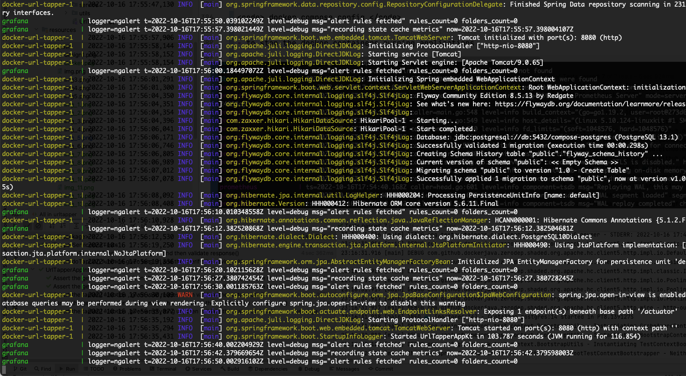
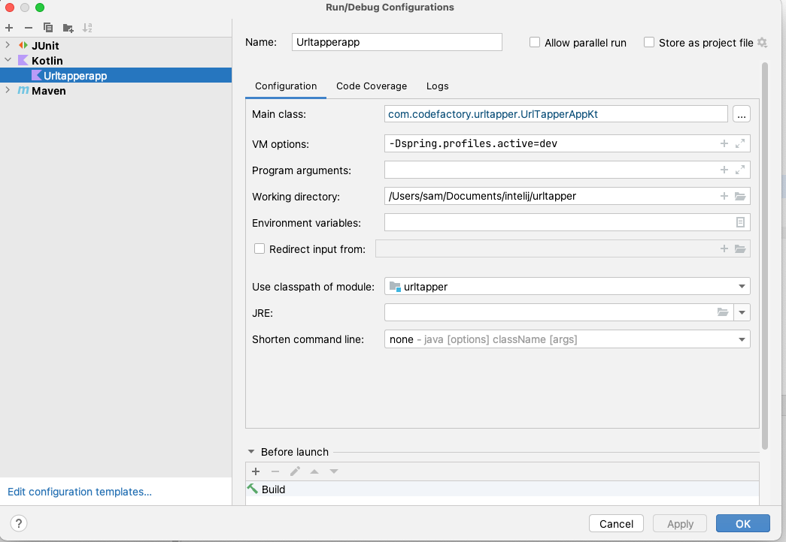

# UrlTapper #
###### v 0.0.2 - Draft initial version
######  Author: Sam
[](https://github.com/samglobalcoder/urltapper/blob/main/.github/workflows/maven.yml)

# Description #
#### This rest API helps the end user shorten the URL and can be retrieved via the hashing key or hashed URL.

# Use Case Brief #
1. The user passes the long URL to one of the rest API methods, it has to generate the hashing which can be sent back to the user again.
2. The user passes the shortened or hashed URL to one of the rest API methods, it has to send back the longer / actual URL to the end user.

Based on the use case and requirement document, I have added the following input considered for designing this application,
- scalable, maintainable , production ready API, easily deployed in any environments.
- monitoring and study the complex problems through interfaces

# Assumptions & Considerations #
Since it's a minimum viable product, as a developer, I have taken the following assumption and consideration help to the design and development of API.

1. This proof concept could be a full-fledged solution in the future.
2. This API exposes two different functions outside the world.

    a) tapUrl() - post the longer URL link and retrieve the hashed key or a URL.

    b) getUrl() - get the shortened URL or hashed key and retrieve the longer URL.

3. Since there is no specific ask on implementing the methods, I consider tapUrl for a post operation and getUrl for a get operation.
   The post operation is reliable in terms of handling bigger request data and given a real thought on what would be the best thing for the end-user perspective.
4. Both methods will be having minimal request validation for checking request input.
5. There is a different hashing techniques have been followed, I have studied what's the best way to compensate for the
   performance and handle multiple requests at the same time. we have considered lots of loopholes when using lower 
   algorithms such as MD-5 / SHA-1 as per the recommendation SHA-256 could be used when compared with SHA-512.
   well-known third-part API implementation such as Guava / Apache Commons provides utility methods for hashing.
6. The tables currently stores shorturl(150) and longurl(2000) handle varying characters limit up to 2000 in size.
7. However, I have indexed the shorturl column to increase the lookup performance.
8. After successful hashing the UUID value will be returned to the end user.
9. when a user wants to retrieve the actual URL, it can be resolved inside the postman browser, 
   when making the actual test calls.But redirection not happening in the swagger page
10. There is a chance of bottlenecks in performance, hashing collisions, concurrent request processing, and ambiguity
    which might be a critical aspect of the study required before and after solution development. certain aspects
    I would like to give as a note what are the pain areas.

    There is a scenario that millions of records to be stored in the database might be a cumbersome activity,
    additionally, retrieval also is a more time-consuming aspect.

    **Implementing the Load Balancer / High availability / Scaling of pods will be a key part of handling concurrent user requests and serving at downtimes.**
    **Implementing the period offline deletion or archival component might help us to keep up the records for a certain time. It definitely added benefit for maintaining a large volume of shortening records.**
    **Introducing the caching strategies between the application and database will help us to reduce the unnecessary call to the database when we do a lookup.**
    **Making smaller urls require more hashing techniques, that will be considered in future enhancements , because of the scope and time frame of this requirment.**


# Non-Functional Approach

* Grafana utilized for maintaining application status , health and performance in production scenario.
* Container images can be scaled up during the downtime or if the high volume of records being processed.


# Future Functional Enhancement

* Hashing can be more optimized , since currently the SHA256 returns longer length, which reduce time for hashing.
* Deletion of unused records using batches would be great choice to more optimize database calls
* Indexing columns highly increase the faster query performance and less turn around time.
* Optimize the size of column for long urls in database.
* Request validation like whether the user sending an actual URL or which is a plain text needs to be implemented.

# High Level Design

## Architectural Diagram  ###


## Operation tapUrl() Flow Steps ##

1. Any user submitting a long URL for shortening to the tapUrl() function, will initially validate the request body has the long URL information 
   Technically we are checking whether the content is empty  / length should be more than 20 size,  if its fails in condition, it will trigger the Validation Exception with a message.
2. The long URL will be hashed using SHA-256 in the service layer, it will be checked against the database for whether the record is there or not.
3. If the record is present, the service layer assumes this is an old record and the retrieved UUID value will be sent 
   back to the user with a custom domain URL.
4. If the record is not present, the service layer assumes, it's a new record that has to be saved inside the database. 
   The record will be stored with the id, hashed URL value, and long URL.
5. if it's saved in the database the UUID will be appended with a custom domain URL and sent back to the user.

## Flow Diagram ###


## Operation getUrl() Flow Steps ##

1. Any user submitting a shortened URL or hashed URL value to the getUrl() function,
   will initially be validated with field validation has the content which has the proper domain URL.
2. if the validation fails, it will be thrown as Validation Exception with the message,
3. If the field validation success, the shortened URL will be split in the service layer,
   and the hash value will be converted back to UUID, Thus UUID will be queried in the database and 
   checked for record availability.
4. if the record is not available, then the user is intimated with a Data validation Exception message from the controller.
5. if the record is present, the long URL is retrieved and displayed. ideally, URL redirection will happen. 
   for the current scope the URL will be visible at the postman, but not in the swagger.

## Flow diagram ###


# Developmental Setup for API development

- Open JDK v 11 [jdk](https://openjdk.org/projects/jdk/11/)
- Kotlin Programming [Kotlin](https://kotlinlang.org/)
- Swagger contract design [swagger Editor](https://editor.swagger.io/)
- Spring Boot 2.7.4 project creation with Kotlin  / dependencies setup [Spring initializer](https://start.spring.io/)
- Configure the Docker and containerize postgresql database [Docker Setup ](https://www.docker.com/products/docker-desktop/)
- Flyway is used for database migration. [Postgresql db migration](https://flywaydb.org/documentation/database/postgresql)
- IntelliJ Community Edition Required. [Intelij Community Edition](https://www.jetbrains.com/idea/download/#section=mac)
- pgAdmin for console database query execution.[pgAdmin](https://www.pgadmin.org/)
- Operating System mac Os [Mac OS Big Sur](https://en.wikipedia.org/wiki/MacOS_Big_Sur)
- Terminal for command execution.[Terminal Commands](https://ss64.com/osx/)
- Postman for testing the API. [Postman Testing Tools](https://www.postman.com/product/tools/)
- Junit  / Mockito for writing Unit [Junit](https://junit.org/junit4/) [Mockito](https://site.mockito.org/)
- Integration Testing by Test container [Post gres Test container](https://www.testcontainers.org/modules/databases/postgres/)
- Apache Maven [Maven](https://maven.apache.org/guides/introduction/introduction-to-the-lifecycle.html)
- Grafana [Grafana](https://grafana.com/grafana/download)
- Prometheus [prometheus](https://prometheus.io/)

### Spring initializer - Project Setup ###


### Docker Desktop - Cloud environment ###


### Postgresql Database  ###


### PG Admin for using Console operation  ###


# Technology Stack
***********************
## Framework | Version ##
***********************
Spring - Boot / data - jpa v 2.7.4
***********************
Kotlin v 1.7.20
***********************
postgreSQL database 14 v 42.2.18 / In docker used 13.1 due to start up issues.

Note : Before starting up the local application, we have to create the database first. 
some time onstartup database creation not working well with spring boot.

**********************
Springdoc - openAPI v 1.6.11
***********************
log4j v 2.13.0
************************
Guava v 1.1-jre
*****************************
mockito -junit -jupiter v 4.8.0
***********************
mockito - kotlin v 4.0.0
***********************
Spring boot starter Test v  2.7.4
******************************
Maven V 3.2.0
***************
pg Admin v 4
*************
Post man v 9.2
**************
Flyway 8.5.3
***************
Prometheus V 2.39.1
*******************
Grafana V 9.2.0

# Implementation

Methodologies : saFe Agile / Test Driven Development

As per the Agile fashion , we have to design the contract first using any Intelij provided open API plugin or swagger edition used.

### Swagger Editor - Prepare & Modify the Contract ###


#  Local Development Environment Setup (ioS Based)  

1. Set up a GitHub and create git repository.
2. Use homebrew to install the proper open jdk version [open jdk11](https://formulae.brew.sh/formula/openjdk@11)
3. Install the postgreSQL v 14 in the Application folder [postgreSQL Installation](https://www.postgresql.org/download/macosx/)
4. Install the pg Admin V4 client tool helps to connect with postgreSQL and perform various database related operations. [pgAdmin install ](https://www.pgadmin.org/)
5. Set up an initial Spring boot project with necessary postgresql dependencies / test containers / mockito / junit.
6. Make sure database created as configured as in the yaml, This can be changed based on your naming convention.
7. Use the pgAdmin tool to create the initial database.
8. If flyway is added in the pom.xml the table automatically created (Refer : application.yaml) **whenever  you need you disable the flyway in pom.xml to have more control for your development**
9. **Install the docker desktop in your local, its important test container environment has to be set by docker 
 while we wamt to run the integration test.**
10. Keep-up the Stackoverflow page in your chrome, always there is solution for your challenges you are facing. Happy Coding :) 

# How to Create the postgreSQL server and Database Using pgAdmin

Make sure postgreSQL running in your local(5432) and create the server instance first


# Project Setup and Directories 

organize the directories and packages makes easier to find relevant files. 


# GitHub Project setup 


# Prerequisite For Enabling Prometheus and Grafana

- Ensure spring boot project integrated with two important pom.xml dependency.

````
         <dependency>
            <groupId>org.springframework.boot</groupId>
            <artifactId>spring-boot-starter-actuator</artifactId>
        </dependency>
         <dependency>
            <groupId>io.micrometer</groupId>
            <artifactId>micrometer-registry-prometheus</artifactId>
            <scope>runtime</scope>
        </dependency>
````

- Ensure the application.yaml file must have the below entries.

````
management:
  endpoints:
    web:
      exposure:
        include: prometheus
  endpoint:
    health:
      show-details: always
````

The spring actuator will send the application health details to prometheus . Grafana is atoolw when you can collect all the health information of the application
using prometheus metrics. Grafana will display the information of the application.


### How To Run the Project in Local Docker Environment  ###

- Get the source codes, and import it into your favorite IDE.

```` git clone GITHUB PROJECT LINK ````

- Run docker compose . A docker-compose.yml is provided under the root folder (/docker/)

```` docker compose build ````

-- we can byild the images  and starting of deployment in docker container.

```` docker compose up --build ````


```` docker-compose up ````


```` docker-compose down ````


**To Scale up docker pods**

````docker-compose up --scale url-tapper=3 ````

**postgresSQL Startup**


**FLYway Startup**



**Docker Deployed Images**


**Prometheus Window**


### Grafana & Prometheus Data Capturing

After completing all requisite measures , we have to use docker to build & deploy our images by docker-compose.yaml under docker folder of the project

Below is the login information , after docker boot up all the application, you can check the grafana also started or not [Grafana](http://localhost:3000/)

Username: admin
Password: admin

**Grafana Login - To Configure the datasource**


**Grafana - Add datasource**


**Grafana - Spring Monitor**


**Grafana  - Data Source Saving**


**Grafana  - Importing the Spring Monitor using import option**


**Grafana  - After successful importing you able to see all the performance / bottleneck / Health in grafana**


[Spring Boot 2.1](https://grafana.com/grafana/dashboards/11378)

- To verify the compose configuration

```` docker compose config ````

- to stop the docker containers running applications

```` docker compose down ````

[Spring Boot 2.1](https://grafana.com/grafana/dashboards/11378)

- To Run the Application Locally from the studio



use the run configuration to run the application as well maven to compile the project

```` mvn clean compile package install ````


# How to Run the JUnits and Integration Tests  From Studio

1. Select the Project Root folder from left side panel.
2. When you right-Click, the context menu show you "Run All Tests"
3. once you performed "Run all Tests" , you can see the studio console and integration test status.

**Note :  Integration test execution,  Ensure Docker Setup / Database setup is working fine , you are able to start up the server locally**


Docker will display all the containers instantiated and installed in docker


# Log Analysis and Debugging

Always we have to enable application level logging to see what;s going on while debuggging. Its helps narrow down 
the root casue failure. so Logging is very important, I have enabled spring SL4J logging  [SLF4J](https://www.slf4j.org/manual.html)


# Manual Test Execution

### when Sending the Long URL, and Then it should receive the shortened URL with status code 200  ###

**Request :** 

````
{
  "longUrl": "https://www.google.com/search?q=software+test+design+and+testing+methodologies&source=lnms&tbm=isch&sa=X&ved=2ahUKEwjak6vvreL6AhVkXnwKHVBHBowQ_AUoAXoECAEQAw&biw=1920&bih=944&dpr=1#imgrc=BGg06cJSEFrjiM"
}
````

**Response :**

````
{
    "shortUrl": "https://codefactory.com/d8d74b37-60c7-4689-b08a-b40bd55874a6"
}
````

**Curl :**

````
curl --location --request POST 'http://localhost:8080/v1/tapurl' \
--header 'Content-Type: application/json' \
--data-raw '{
  "longUrl": "https://www.google.com/search?q=software+test+design+and+testing+methodologies&source=lnms&tbm=isch&sa=X&ved=2ahUKEwjak6vvreL6AhVkXnwKHVBHBowQ_AUoAXoECAEQAw&biw=1920&bih=944&dpr=1#imgrc=BGg06cJSEFrjiM"
}'
````

**Postman Result :**


## When Passing the Short URL and Then expecting to the long URL  ##

**Curl :**

````
curl --location --request GET 'http://localhost:8080/v1/geturl?shortUrl=https://cf.com/9d7e4c9c-dd0d-4565-90d0-87ce54697ae7' \
--header 'Content-Type: application/json' \
--data-raw '{
    "shortUrl": "https://codefactory.com/urltapper/2e021d8a6f8820a6a20b07c6a2e7042b7d5807890245dd1aa061a4e30547bc5e"
}'
````

**Postman Result :**


##  ValidationException | Error Code 400
when long URL value is less than 20 character or not present, and then throw validation exception tapUrl()

**Request :**
````
{
    "message": " Long url not found in the request or very smaller in size"
}
````

**Postman Result :**


**Curl :**

````
curl --location --request POST 'http://localhost:8080/v1/tapurl' \
--header 'Content-Type: application/json' \
--data-raw '{
  "longUrl": "8"
}'
````

##  ValidationException | Error Code 400
when short url not found in the incoming request field of getUrl and then Validation Exception with Response Code()

**Response :**

````
{
"message": " Given short url is invalid"
}
````

**Curl :**

````
curl --location --request GET 'http://localhost:8080/v1/geturl?shortUrl=https%3A%2f.com%2F74a07003-cfa7-47c5-8d07-2cf7ef2a335f' \
--header 'Content-Type: application/json' \
--data-raw '{
    "shortUrl": "https://codefactory.com/urltapper/2e021d8a6f8820a6a20b07c6a2e7042b7d5807890245dd1aa061a4e30547bc5e"
}'
````

**Postman Result :**


##  DataNotFoundException | Error Code 404
when given dhort URL and Then long URL not found in database of getUrl()

**Response :**

````
{
    "message": " Long url not found , please create new short url"
}
````

**Curl :**

````
curl --location --request GET 'http://localhost:8080/v1/geturl?shortUrl=https://cf.com/9d7e4c9c-dd0d-4565-90d0-87ce54697ae1' \
--header 'Content-Type: application/json' \
--data-raw '{
    "shortUrl": "https://codefactory.com/urltapper/2e021d8a6f8820a6a20b07c6a2e7042b7d5807890245dd1aa061a4e30547bc5e"
}'
````

**Postman Result :**


# GitHub Action for Enabling Build and Pipeline


# Build Status for GitHub each of your code push and merge.


# Build Status for GitHub each time when your code push and merge.


### Reference Documentation
For further reference, please consider the following sections:

* [Official Apache Maven documentation](https://maven.apache.org/guides/index.html)
* [Spring Boot Maven Plugin Reference Guide](https://docs.spring.io/spring-boot/docs/2.7.4/maven-plugin/reference/html/)
* [Create an OCI image](https://docs.spring.io/spring-boot/docs/2.7.4/maven-plugin/reference/html/#build-image)
* [Coroutines section of the Spring Framework Documentation](https://docs.spring.io/spring/docs/5.3.23/spring-framework-reference/languages.html#coroutines)
* [Spring Web](https://docs.spring.io/spring-boot/docs/2.7.4/reference/htmlsingle/#web)
* [Flyway Migration](https://docs.spring.io/spring-boot/docs/2.7.4/reference/htmlsingle/#howto.data-initialization.migration-tool.flyway)
* [Spring Data JPA](https://docs.spring.io/spring-boot/docs/2.7.4/reference/htmlsingle/#data.sql.jpa-and-spring-data)
* [Prometheus](https://docs.spring.io/spring-boot/docs/2.7.4/reference/htmlsingle/#actuator.metrics.export.prometheus)


### Guides
The following guides illustrate how to use some features concretely:

* [Building a RESTful Web Service](https://spring.io/guides/gs/rest-service/)
* [Serving Web Content with Spring MVC](https://spring.io/guides/gs/serving-web-content/)
* [Building REST services with Spring](https://spring.io/guides/tutorials/rest/)
* [Accessing Data with JPA](https://spring.io/guides/gs/accessing-data-jpa/)